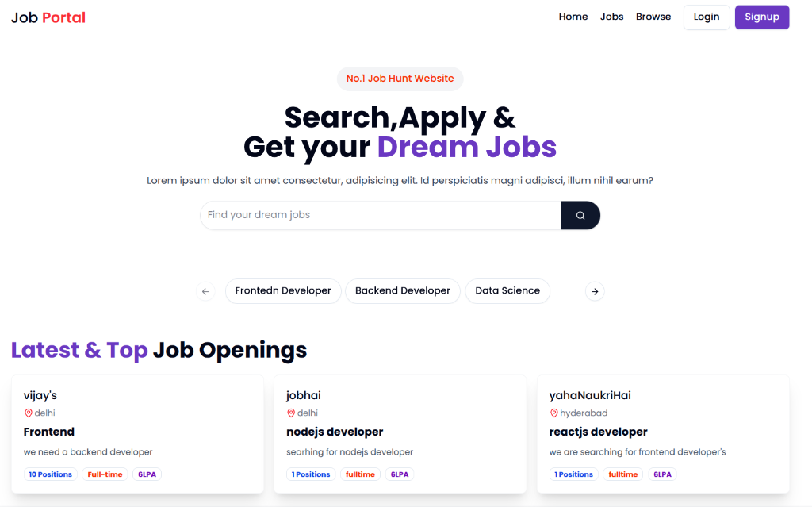

# Job Portal (MERN Stack)



A full-stack Job Portal application built using the **MERN** (MongoDB, Express, React, Node.js) stack. This platform connects job seekers with recruiters, allowing users to browse jobs, apply, and manage their applications efficiently.

[**Live Demo**](https://mern-job-portal-pjyl.onrender.com)

## 🚀 Features

- **User Authentication**: Secure Login and Signup for Candidates and Recruiters (using JWT).
- **Job Search & Filtering**: Advanced search functionality to find jobs by title, location, or category.
- **Job Listings**: Explore widely categorized job openings (Frontend, Backend, Data Science, etc.).
- **Application System**: Candidates can apply to jobs directly.
- **Recruiter Dashboard**: Recruiters can post jobs and manage applications (implied).
- **Responsive Design**: Fully optimized for mobile and desktop devices.
- **Modern UI**: Built with **Tailwind CSS**, **Shadcn UI**, and **Framer Motion** for a seamless user experience.

## 🛠️ Tech Stack

### Frontend

- **React.js** (v19) with **Vite**: Fast, modern frontend development.
- **Tailwind CSS** (v4): Utility-first CSS framework for styling.
- **Redux Toolkit**: State management.
- **Radix UI / Shadcn**: Accessible UI components.
- **Framer Motion**: Smooth animations.
- **Axios**: HTTP requests.
- **React Router DOM**: Navigation.

### Backend

- **Node.js**: JavaScript runtime.
- **Express.js**: Web framework for the API.
- **MongoDB** with **Mongoose**: NoSQL Database.
- **Cloudinary**: Cloud storage for file uploads (resumes, logos).
- **Multer**: Middleware for handling file uploads.
- **JWT & BCryptJS**: Authentication and security.

## 📂 Project Structure

```bash
mern-job-portal/
├── backend/            # Express.js API
│   ├── src/
│   │   ├── controllers/
│   │   ├── models/
│   │   ├── routes/
│   │   └── ...
├── frontend/           # React + Vite Frontend
│   ├── src/
│   │   ├── components/
│   │   ├── pages/
│   │   ├── redux/
│   │   └── ...
└── README.md           # Project documentation
```

## ⚙️ Installation & Setup

Follow these steps to run the project locally.

### 1. Clone the repository

```bash
git clone <repository-url>
cd mern-job-portal
```

### 2. Backend Setup

Navigate to the backend directory and install dependencies:

```bash
cd backend
npm install
```

Create a `.env` file in the `backend` directory with the following variables:

```env
PORT=8000
MONGO_URI=your_mongodb_connection_string
SECRET_KEY=your_jwt_secret_key
CLOUDINARY_CLOUD_NAME=your_cloud_name
CLOUDINARY_API_KEY=your_api_key
CLOUDINARY_API_SECRET=your_api_secret
FRONTEND_URL=http://localhost:5173
```

Start the backend server:

```bash
npm run dev
# Server should run on http://localhost:8000
```

### 3. Frontend Setup

Open a new terminal, navigate to the frontend directory:

```bash
cd frontend
npm install
```

Create a `.env` file (if required by your setup) or ensure API endpoints point to `http://localhost:8000`.

Start the frontend development server:

```bash
npm run dev
# App should run on http://localhost:5173
```

## 🔗 Deployment

The project is deployed on **Render**.

- **Frontend & Backend**: [https://mern-job-portal-pjyl.onrender.com](https://job-portal-backend-tpnq.onrender.com)

